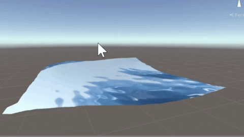
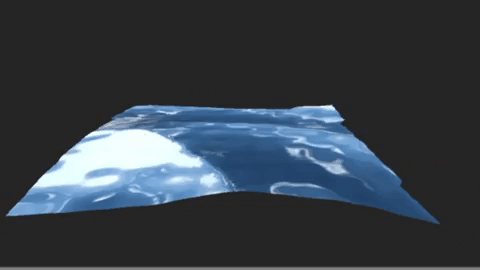

# UnityOcean

A simple ocean surface model.

Editor View:

Game View:

## Model

The wave model is a simplified version of the model proposed by Jean-Christophe Gonzato and Bertrand Le Saec in their paper *A phenomenological model of coastal scenes
based on physical considerations*. We assume infinite depth and can therefore ignore waves being reflected by the ocean floor. The infinite depth assumption also allows us to neglect light refraction, we simply use a solid color for refracted light.
